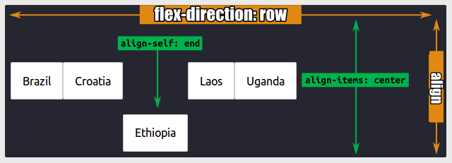

# Align self

With `align-items` you move all the items at once (on the **non-main axis**).
With `align-self` you move only one of the items.

In this exercise, you will use align-self and align-items to change the position of the items. Follow the steps below to complete this exercise:

1. Look at the First list of countries. Then look at the First Result displayed to the side. Find the differences between the two lists.
2. Make the First list of countries look like the First Result list.
3. Do the same thing for the Second and Third list.
---

You can use the same values for `align-self` as you used for `align-items`.